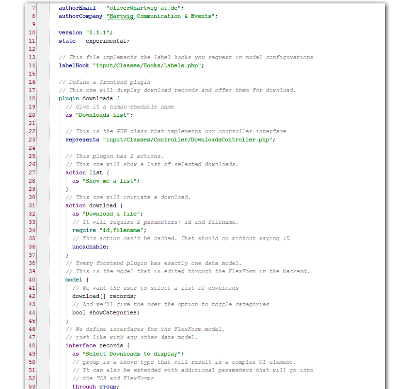

TYPO3 Extension Generator
=========================

The **TYPO3 Extension Generator** is a tool to generate a TYPO3 extension from a laughably simple markup.

This is the output of generating a replica of [EXT:downloads](https://github.com/oliversalzburg/downloads):

    51 INFO : Reading 'c:\Users\Oliver\Desktop\user_downloads.extgen'...
    70 INFO : Parsing...
    115 INFO : Found extension definition for 'user_downloads'
    116 INFO : Clearing output directory...
    190 INFO : Generating extension...
    193 INFO : Generating ext_emconf.php...
    220 INFO : Generating plugins...
    227 INFO : Generating FlexForm for 'downloadsFe'...
    238 INFO : Generating controller 'Tx_UserDownloads_Controller_DownloadsFeController'...
    240 WARN : The class name of your implementation MUST be 'UserDownloadsDownloadsFeControllerImplementation'!
    240 INFO : Merging implementation 'input/Classes/Controller/DownloadsController.php'...
    245 INFO : Generating TypoScript constants...
    248 INFO : Generating TypoScript setup...
    250 INFO : Generating default Fluid layout 'Resources/Private/Layouts/Default.html'...
    251 INFO : Generating Fluid template 'Resources/Private/Templates/DownloadsFe/List.html'...
    252 INFO : Generating Fluid template 'Resources/Private/Templates/DownloadsFe/Download.html'...
    256 INFO : Registering modules...
    256 INFO : Registering module 'DownloadImporter'...
    257 INFO : Generating SQL tables...
    257 INFO : Generating SQL table 'tx_userdownloads_domain_model_download'...
    259 INFO : Generating SQL table 'tx_userdownloads_domain_model_downloadcategory'...
    259 INFO : Generating SQL table 'tx_userdownloads_domain_model_installnote'...
    259 INFO : Generating SQL table 'tx_userdownloads_domain_model_access'...
    265 WARN : The class name of your implementation MUST be 'UserDownloadsDownloadRepositoryImplementation'!
    265 INFO : Merging implementation 'input/Classes/Domain/Repository/DownloadRepository.php'...
    270 INFO : Generating model 'Classes/Domain/Model\Download.php'...
    271 INFO : Generating repository 'Classes/Domain/Repository\DownloadRepository.php'...
    273 INFO : Generating Fluid partial 'Resources/Private/Partials\Download.html'...
    275 WARN : The class name of your implementation MUST be 'UserDownloadsDownloadCategoryRepositoryImplementation'!
    275 INFO : Merging implementation 'input/Classes/Domain/Repository/DownloadCategoryRepository.php'...
    277 INFO : Generating model 'Classes/Domain/Model\DownloadCategory.php'...
    278 INFO : Generating repository 'Classes/Domain/Repository\DownloadCategoryRepository.php'...
    280 INFO : Generating Fluid partial 'Resources/Private/Partials\DownloadCategory.html'...
    281 WARN : The class name of your implementation MUST be 'UserDownloadsInstallNoteRepositoryImplementation'!
    281 INFO : Merging implementation 'input/Classes/Domain/Repository/InstallNoteRepository.php'...
    283 INFO : Generating model 'Classes/Domain/Model\InstallNote.php'...
    284 INFO : Generating repository 'Classes/Domain/Repository\InstallNoteRepository.php'...
    285 INFO : Generating Fluid partial 'Resources/Private/Partials\InstallNote.html'...
    287 INFO : Generating model 'Classes/Domain/Model\Access.php'...
    288 INFO : Generating repository 'Classes/Domain/Repository\AccessRepository.php'...
    289 INFO : Generating Fluid partial 'Resources/Private/Partials\Access.html'...
    292 INFO : Generating TCA for model 'access'...
    298 INFO : Flushing 'Resources/Public/Icons/tx_userdownloads_domain_model_access.png'...
    298 INFO : Generating TCA for model 'download'...
    299 INFO : Flushing 'Resources/Public/Icons/tx_userdownloads_domain_model_download.png'...
    300 INFO : Generating TCA for model 'downloadCategory'...
    301 INFO : Flushing 'Resources/Public/Icons/tx_userdownloads_domain_model_downloadcategory.png'...
    302 INFO : Generating TCA for model 'installNote'...
    302 INFO : Flushing 'Resources/Public/Icons/tx_userdownloads_domain_model_installnote.png'...
    304 INFO : Generating dynamic config file 'Configuration/TCA/Access.php'...
    315 INFO : Generating dynamic config file 'Configuration/TCA/Download.php'...
    317 INFO : Generating dynamic config file 'Configuration/TCA/DownloadCategory.php'...
    319 INFO : Generating dynamic config file 'Configuration/TCA/InstallNote.php'...
    322 INFO : Merging required file 'Classes/Utility/Filename.php'...
    323 INFO : Merging required file 'Classes/Utility/SortedDirectoryIterator.php'...
    324 INFO : Merging required file 'Resources/Public/Css/downloads.css'...
    325 INFO : Merging required file 'Resources/Public/Icons/TypeIcons/document--arrow.png'...
    326 INFO : Merging required file 'Resources/Public/Icons/TypeIcons/document--exclamation.png'...
    --- snip ---
    462 INFO : Merging required file 'Resources/Public/Icons/TypeIcons/documents-stack.png'...
    463 INFO : Merging required file 'Resources/Public/Icons/TypeIcons/documents-text.png'...
    463 INFO : Merging required file 'Resources/Public/Icons/TypeIcons/documents.png'...
    464 INFO : Merging required file 'Resources/Public/Icons/TypeIcons/LICENSE.txt'...
    465 INFO : Flushing 'ext_icon.gif'...
    468 INFO : Flushing 'Resources/Private/Language/locallang_be.xml'...
    469 INFO : Flushing 'Resources/Private/Language/locallang_db.xml'...
    471 INFO : Flushing 'Configuration/FlexForms/flexform_downloadsfe.xml'...
    472 INFO : Flushing 'ext_tables.php'...
    474 INFO : Flushing 'ext_localconf.php'...
    475 INFO : Flushing 'Classes/Hooks/Labels.php'...
    Press ENTER to exit.
    